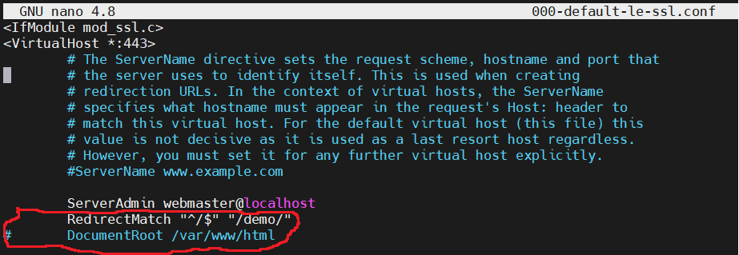
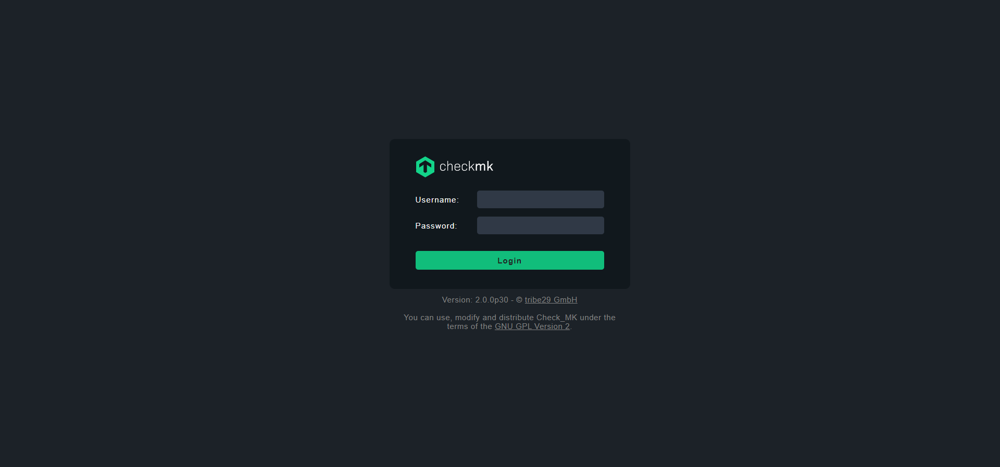

# checkmk 2.0.0p30 Raw


## Mục tiêu:
**- [Cài đặt](https://docs.checkmk.com/latest/en/install_packages_debian.html) và thiết lập cấu hình cơ bản checkmk ver 2.0.0p30 raw trên server Ubuntu 20.04**

**- Cài đặt [plugin notification Telegram](https://checkmk.com/blog/checkmk-notifications-via-telegram)**

**- Cài đặt extension packages MKP monitor [dir_size](https://github.com/HeinleinSupport/check_mk_extensions/tree/cmk2.0/dir_size)**

**- [Thông báo định kì các sự cố dịch vụ](https://docs.checkmk.com/latest/en/notifications.html) và [bảo mật website checkmk bằng HTTPS](https://docs.checkmk.com/latest/en/omd_https.html)**

## Điều kiện kiên quyết:
- Các thành phần phụ thuộc, checkmk đi kèm với phiên bản Apache, PHP, Python riêng của nó khi cài bằng **apt install**
- Lưu ý: để sử dụng được plugin notification Telegram cần cài đúng version

## I. Setup checkmk:
### 1. Tải gói DEB và cài đặt
```console
wget https://download.checkmk.com/checkmk/2.0.0p30/check-mk-raw-2.0.0p30_0.focal_amd64.deb
apt install dpkg-sig
wget https://download.checkmk.com/checkmk/Check_MK-pubkey.gpg
gpg --import Check_MK-pubkey.gpg
dpkg-sig --verify check-mk-raw-2.0.0p30_0.focal_amd64.deb
apt install ./check-mk-raw-2.0.0p30_0.focal_amd64.deb
omd version
```
### 2. Thiết lập website:
```console
omd create demo
```
Trong đó: **demo** là tên website của bạn (thay đổi để phù hợp với dự án của bạn)

```console
omd su demo
htpasswd etc/htpasswd cmkadmin
```
Quản trị trang web bằng dòng lệnh và sử dụng htpasswd để thay đổi password mặc định tài khoản cmkadmin

```console
omd status
omd start
```
Khi tạo xong website, nó vẫn chưa thực sự khởi động. Bận cần start website bằng câu lệnh trên

**=> Test đăng nhập website: http://your_ip_checkmk/demo**
### 3. Cài đặt checkmk agent
```console
wget https://your_ip_checkmk/demo/check_mk/agents/check-mk-agent_2.0.0p30-1_all.deb
apt install ./check-mk-agent_2.0.0p30-1_all.deb
```
Cài đặt agent trên server muốn monitoring, thay thế **your_ip_checkmk/demo** thành IP server checkmk, website của bạn
### 4. Add agent vào server checkmk
Setup -> Hosts -> Add host. Nhập hostname và IPv4 -> Save & go to service configuration


Cuối cùng chọn **Activate on selected sites**. Check lại Monitor -> All hosts


## II. Cài đặt plugin notification Telegram
### 1. Tạo bot Telegram và chat ID của bot hoặc 1 group mà bạn muốn Checkmk gửi thông báo tới:
- Lấy chat ID tại đây: https://api.telegram.org/bot[TOKEN]/getUpdates” (Chú ý thay thế [TOKEN]) 

### 2. Setup plugin:
```console
omd su demo
cd ~/local/share/check_mk/notifications/
git clone https://github.com/filipnet/checkmk-telegram-notify.git .
mv check_mk_telegram-notify.sh telegram.sh
chmod ug+x telegram.sh
```
Sửa file bash bỏ hoặc comment lại phần IPv6 sau đó **restart lại apache**


```console
omd restart apache
```

### 3. Sử dụng plugin trên giao diện website:

Setup -> Notifications và chọn hình ô vuông để sao chép 1 rule tương tự


Sửa lại thông tin cho phù hợp. Ô số 2 sửa 3 dòng cuối lần lượt là Token -> Chat ID -> privacy -> chọn **Save**


Cuối cùng là chỉnh cho user được Contact Groups: Setup -> Users -> chọn chỉnh sửa ID cmkadmin -> phần Contact Groups tích **Everything** -> **Save** và **Activate on selected sites**

**=> Test alerts Telegram sử dụng Fake check results**


## III. Setup extension packages MKP monitor dir_size
Để hiểu rõ về **extension packages MKP** trong checkmk vui lòng đọc tại website chính thức của nhà sản xuất: [click here](https://docs.checkmk.com/2.0.0/en/mkps.html)
### 1. Cài đặt extension packages dir_size
- Dowload file mkp về máy local tại link: [here](https://github.com/HeinleinSupport/check_mk_extensions/tree/cmk2.0/dir_size)
- Sử dụng scp hoặc bất kì công cụ nào để chuyển file vào server checkmk
- Cài đặt:
    ```console
    mkp install mypackage-1.0.mkp
    mkp list dir_size
    ```
    Sau khi cài đặt xong list ra được các tệp như sau là đã thành công

    
- scp file **/omd/sites/demo/local/share/check_mk/agents/plugins/dir_size** -> agent cần monitor folder tại đường dẫn **/usr/lib/check_mk_agent/plugins**
- Trên agent tạo file **dir_size.cfg** vào đường dẫn **/etc/check_mk** (Muốn monitor folder nào thì thêm đường dẫn vào file, tính theo từng dòng)

    

### 2. Sử dụng extension packages dir_size
Trên giao diện checmk -> Monitor -> All hosts -> chọn host agent -> Host -> Service configuration


Check thấy có 4 service mới được monitor -> Fix all -> chọn phần change có icon chấm than trên góc bên phải -> Activate on selected sites


Test xét ngưỡng cho 1 folder và check alerts về Telegram


## IV. Thông báo định kì các sự cố dịch vụ và bảo mật website checkmk bằng HTTPS
### 1. Thông báo định kì các sự cố dịch vụ
Setup -> Periodic notifications during service problems -> Create rule in folder


### 2. Setup HTTPS website
- Kích hoạt module ssl apache
    ```console
    a2enmod ssl
    systemctl restart apache2
    ```
- Cài đặt và sử dụng ssl Let’s Encrypt
    ```console
    sudo apt install certbot python3-certbot-apache
    ```
    - Đã cấu hình ít 1 bản ghi A gồm your_domain được trỏ đến địa chỉ IPv4 public của bạn (và 1 bản A -> www.your_domain)
    ```console
    sudo certbot --apache -d your_domain
    ```
    - Sửa file config SSL mới tại **/etc/apache2/sites-enabled** để mặc định chuyển hướng khi nhập domain sang website checkmk /demo (RedirectMatch "^/$" "/demo/")
    
    
    - Tại folder đó, Sửa tiếp file **000-default.conf**. Chèn thêm vào khối **VirtualHost**
    
    - Check lại và áp dụng cấu hình mới
        ```console
        sudo apache2ctl configtest
        sudo systemctl restart apache2
        ```
    
- Test truy cập vào website bằng domain


## Chúc các bạn thành công  